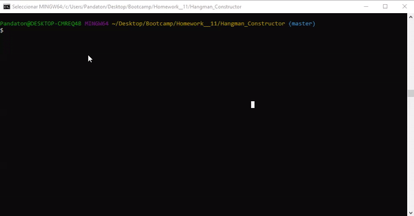

# Hangman Constructor

This is a simply Hangman game development in terminal with node.js and inquirer an chalk npm packages. The goal is that you guess wich name of the **Saint Seiya** anime is in the underscore before your chances over.

## How to play

* The game will ask you for a letter betwen A - Z to start
* Then will provide a random character name
* If the letter is correct the game fill the letter in the underscore
* But if is wrong add the letter in the "Letters Guessed" and ask you for other
* You cannot repeat letters, if you write a repeat letter or send a empty instruction the program show you the message: "Already guessed or Nothing Entered"
* To win you should guess de name provided

## Installing
To play it just need:
* Download or clone this repo 
* Install the npm packages requirer (inquirer, chalk)
* Open your terminal and open the folder of the repo
* Run the command node index.js, and ejoy it!

## Running the tests
It looks like this in action

## Built With
* Javascript
* Node.js
* Inquirer npm
* Chalk npm
